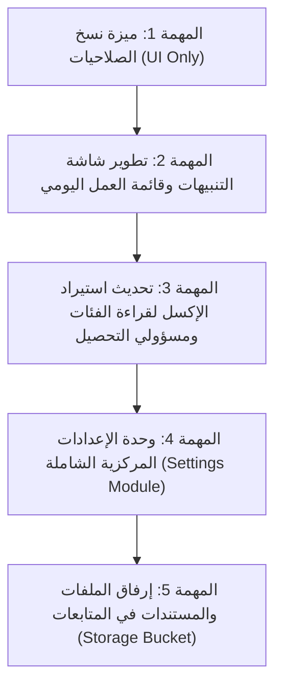

# خطة تنفيذ تعديلات الإصدار الأول (V1 Master Plan)
## نظام إدارة التحصيل ومتابعة العملاء

تم ترتيب المهام بدقة من **الأقل تأثيراً ومخاطرة على المعمارية** إلى **الأعلى تأثيراً**، لضمان استقرار النظام وبناء الميزات خطوة بخطوة.

---

### خريطة المهام المتسلسلة

---

### تفاصيل ملفات المهام (البرومبتات المستقلة)

| # | اسم الملف | الوصف ومستوى التأثير | متطلبات قاعدة البيانات |
|---|---|---|---|
| **01** | [`01_COPY_PERMISSIONS.md`](file:///home/anas.axr/Downloads/Telegram%20Desktop/%D9%86%D8%B8%D8%A7%D9%85%20%D8%A5%D8%AF%D8%A7%D8%B1%D8%A9%20%D8%A7%D9%84%D8%AA%D8%AD%D8%B5%D9%8A%D9%84%20%D9%88%D9%85%D8%AA%D8%A7%D8%A8%D8%B9%D8%A9%20%D8%A7%D9%84%D8%B9%D9%85%D9%84%D8%A7%D8%A1/v1_prompts/01_COPY_PERMISSIONS.md) | **أقل تأثيراً (واجهة فقط):** إضافة زر ومودال لنسخ الصلاحيات من مستخدم لآخر بضغطة زر. | لا يوجد (الـ Schema تدعمه بالفعل). |
| **02** | [`02_NOTIFICATIONS_REDESIGN.md`](file:///home/anas.axr/Downloads/Telegram%20Desktop/%D9%86%D8%B8%D8%A7%D9%85%20%D8%A5%D8%AF%D8%A7%D8%B1%D8%A9%20%D8%A7%D9%84%D8%AA%D8%AD%D8%B5%D9%8A%D9%84%20%D9%88%D9%85%D8%AA%D8%A7%D8%A8%D8%B9%D8%A9%20%D8%A7%D9%84%D8%B9%D9%85%D9%84%D8%A7%D8%A1/v1_prompts/02_NOTIFICATIONS_REDESIGN.md) | **تأثير منخفض إلى متوسط:** إعادة تصميم واجهة التنبيهات لتكون جدول عمل يومي ببطاقات ملونة وإجراءات سريعة. | لا يوجد تعديل جداول (استخدام الـ RPC الموجود). |
| **03** | [`03_EXCEL_IMPORT_UPGRADE.md`](file:///home/anas.axr/Downloads/Telegram%20Desktop/%D9%86%D8%B8%D8%A7%D9%85%20%D8%A5%D8%AF%D8%A7%D8%B1%D8%A9%20%D8%A7%D9%84%D8%AA%D8%AD%D8%B5%D9%8A%D9%84%20%D9%88%D9%85%D8%AA%D8%A7%D8%A8%D8%B9%D8%A9%20%D8%A7%D9%84%D8%B9%D9%85%D9%84%D8%A7%D8%A1/v1_prompts/03_EXCEL_IMPORT_UPGRADE.md) | **تأثير متوسط (Logic & Parser):** تحديث محلل الإكسل للتعرف على أعمدة فئات العملاء والمسؤولين وربطهم آلياً. | تحديث دالة RPC `import_customers_batch`. |
| **04** | [`04_SETTINGS_MODULE.md`](file:///home/anas.axr/Downloads/Telegram%20Desktop/%D9%86%D8%B8%D8%A7%D9%85%20%D8%A5%D8%AF%D8%A7%D8%B1%D8%A9%20%D8%A7%D9%84%D8%AA%D8%AD%D8%B5%D9%8A%D9%84%20%D9%88%D9%85%D8%AA%D8%A7%D8%A8%D8%B9%D8%A9%20%D8%A7%D9%84%D8%B9%D9%85%D9%84%D8%A7%D8%A1/v1_prompts/04_SETTINGS_MODULE.md) | **تأثير عالي (Full Module & Audit):** بناء شاشة الإعدادات المبوبة الشاملة والربط بقاعدة البيانات والـ Audit Log. | تحديث جدول `settings` وإضافة صلاحية `settings`. |
| **05** | [`05_FOLLOWUP_ATTACHMENTS.md`](file:///home/anas.axr/Downloads/Telegram%20Desktop/%D9%86%D8%B8%D8%A7%D9%85%20%D8%A5%D8%AF%D8%A7%D8%B1%D8%A9%20%D8%A7%D9%84%D8%AA%D8%AD%D8%B5%D9%8A%D9%84%20%D9%88%D9%85%D8%AA%D8%A7%D8%A8%D8%B9%D8%A9%20%D8%A7%D9%84%D8%B9%D9%85%D9%84%D8%A7%D8%A1/v1_prompts/05_FOLLOWUP_ATTACHMENTS.md) | **تأثير عالي (Storage & Schema):** تفعيل Supabase Storage لرفع مستندات المتابعة وربطها بالعملاء. | إنشاء Storage Bucket وسياسات RLS وإضافة حقول المرفقات. |

---

### طريقة الاستخدام
استخدم كل ملف `.md` كـ **برومبت مستقل ومكتمل بذاته**، حيث يحتوي كل ملف على:
1. الهدف وسياق العمل.
2. الملفات المستهدفة للتعديل أو الإنشاء.
3. التغييرات البرمجية الدقيقة (Frontend / Backend / SQL).
4. معايير القبول والاختبار والتحقق.
