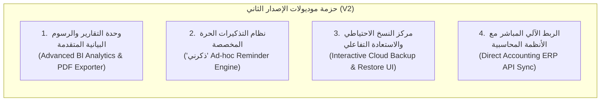

# 📊 التقرير النهائي والمقارنة الشاملة لنطاق العمل (V1 مقابل V2)
## مشروع: نظام إدارة التحصيل ومتابعة العملاء (Smart Collection Platform - SCP)

---

### 📑 فهرس التقرير
1. **المقدمة والغرض من الوثيقة**
2. **منهجية التحليل ومعايير التمييز (V1 vs V2)**
3. **جدول المقارنة المباشر والمفصل بين الوثيقتين**
4. **حزمة الإصدار الأول (Version 1) - المعتمدة للتنفيذ الفوري**
5. **حزمة الإصدار الثاني (Version 2) - الميزات المتقدمة بعقد مستقل**
6. **مصفوفة حماية حقوق الطرفين (العميل & فريق التطوير)**
7. **الخلاصة والتوصيات**

---

### 1. 🎯 المقدمة والغرض من الوثيقة
تهدف هذه الوثيقة إلى وضع **إطار تعاقدي وفني واضح وموثق** يقارن بين:
* **الوثيقة المرجعية الأولى:** `رؤية العميل.md` (نطاق العمل الأساسي المتفق عليه لتأسيس النظام).
* **الوثيقة المرجعية الثانية:** `تعديلات نظام التحصيل .pdf` (المتطلبات والتحسينات الإضافية اللاحقة).

تم إعداد هذا التحليل بناءً على مبدأ **العدالة وحفظ حقوق الطرفين**؛ بحيث لا يُحرم العميل من أي تحسين تشغيلي يدخل في جوهر نجاح النظام، وفي الوقت نفسه لا يُحمَّل المطور أعباء بناء أنظمة وموديولات جديدة كلياً (Sub-systems) خارج نطاق التعاقد الأساسي.

---

### 2. ⚖️ منهجية التحليل ومعايير التمييز

| المعيار | الإصدار الأول (V1 - مجاني / مشمول) | الإصدار الثاني (V2 - عقد وترخيص مستقل) |
| :--- | :--- | :--- |
| **طبيعة الطلب** | تحسين، ضبط، سد ثغرة تشغيلية، أو تحسين تجربة مستخدم لنواة متفق عليها. | بناء موديول جديد كلياً، أو نظام فرعي معقد، أو وظائف تتطلب خدمات خارجية. |
| **المعمارية البرمجية** | استخدام الجداول ومسارات الـ API القائمة مع تعديل/توسيع منطقي بسيط. | تتطلب بنية تحتية جديدة (Background Cron Workers, Storage Pipelines, Reporting Engines). |
| **التأثير على سير العمل** | ضروري لكي يعمل النظام اليومي بكفاءة وواقعية وفق ملفات الإكسل الفعلية. | أدوات استراتيجية وتحليلية عليا أو أتمتة سحابية إضافية يمكن للنظام العمل بدونها في مرحلته الأولى. |

---

### 3. 🔍 جدول المقارنة التفصيلي لكل محور

| المحور / الشاشة | ما ورد في "رؤية العميل" (الأساس) | ما ورد في "ملف التعديلات الجديد" | التصنيف النهائي | التبرير والمنطق التعاقدي |
| :--- | :--- | :--- | :---: | :--- |
| **1. استيراد ملفات الإكسل** | استيراد الأرصدة والبيانات الأساسية لإنهاء التشتت اليدوي. | قراءة أعمدة إضافية ("مسؤول التحصيل"، "فئة العميل") وربطها آلياً دون تدخّل يدوي. | **V1 (مشمول)** | تحسين مباشر لمنطق الاستيراد لتجنب الإدخال اليدوي المزدوج للموظفين. |
| **2. فئات وتصنيفات العملاء** | تقسيم العملاء إلى فئات وربطها بالحوافز. | فلترة تصنيفية (أ، ب، ج، د) مع تصنيف افتراضي (د) يضم الجميع، وتخصيص المسميات لكل محصل. | **V1 (مشمول)** | تحسين واجهة وفلترة للمرونة التشغيلية اليومية للمحصلين. |
| **3. مركز التنبيهات (قائمة العمل اليومي)** | 4 حالات تنبيهية رئيسية (استحقاق، وعد سداد، انقطاع متابعة، مراجعة مدير). | تحويل التنبيهات لـ 6 بطاقات ملونة تفاعلية مع أزرار سريعة (إضافة متابعة فورية، فحص الملف) وربط الصلاحيات. | **V1 (مشمول)** | جوهر عمل النظام ("أداة اتخاذ قرار وجدول عمل يومي للمحصل"). |
| **4. ميزة "ذكرني" (التذكير الحر المخصص)** | غير موجودة بالرؤية الأصلية (الاعتماد كان على تواريخ الاستحقاق وجدول المتابعات النظامي). | نافذة مخصصة لتحديد تنبيه حر بعد (X) يوم مع نص حر لأي عميل بدون قيد بمديونية. | **V2 (عقد جديد)** | موديول تذكيرات شخصية وأجندة مستقلة (Ad-hoc Reminders Engine) خارج دورة حياة التحصيل المحاسبية. |
| **5. نسخ الصلاحيات السريع** | تحديد أدوار المستخدمين والمستخدم المخصص. | زر سريع لنسخ الصلاحيات الحبيبية من موظف لآخر خلال ثوانٍ. | **V1 (مشمول)** | ميزة واجهة ذكية (UI Polish) توفر الوقت ولا تغير معمارية الأمان. |
| **6. إيقاف المستخدم بدل حذفه** | إيقاف الحساب للحفاظ على السجل التاريخي. | تأكيد نفس الآلية ومنع الحذف النهائي. | **V1 (مشمول)** | متوافق تماماً ومطابق للرؤية الأصلية. |
| **7. وحدة الإعدادات المركزية (Settings)** | إعدادات عامة للنسب والفئات والتنبيهات. | شاشة إعدادات مبوبة شاملة (أسعار الصرف، فئات العملاء، نسب الحوافز، عتبات الأيام، وسجل العمليات Audit Log). | **V1 (مشمول)** | ضبط ديناميكي لمعاملات النظام بدل كتابتها الثابتة برمجياً في الكود. |
| **8. مرفقات المتابعة والمستندات** | ذكر إمكانية إرفاق ملفات أو مستندات في تسجيل المتابعة. | رفع وتخزين المستندات والضمانات مع متابعات العملاء. | **V1 (مشمول)** | منصوص عليها نصاً صريحاً في البند الثاني (الفقرة 3) من رؤية العميل. |
| **9. وحدة التقارير المتقدمة ومحرك PDF** | تقارير مالية أساسية للمحاسب والمدير. | شاشة تحليلات بيانية ورسومية متقدمة، ومحرك طباعة وتصدير PDF مخصص، وتحليل أداء تفصيلي. | **V2 (عقد جديد)** | موديول تحليل بيانات ورسوم بيانية وتوليد ملفات PDF (BI & Reporting Engine) يتطلب مكتبات وبنية معالجة مخصصة. |
| **10. النسخ والاستعادة السحابي من الواجهة** | الحفاظ على البيانات وحمايتها مركزياً. | واجهة متكاملة للتحكم في النسخ والاستعادة السحابية واختيار الـ Snapshot من الواجهة. | **V2 (عقد جديد)** | البنية التحتية في V1 مؤمنة عبر نسخ سحابي آلي مدار (Managed Cloud Backups)، بينما بناء لوحة إدارة استعادة تفاعلية يتطلب صلاحيات خادم سحابي حساسة (DevOps Level). |
| **11. الربط المباشر مع الأنظمة المحاسبية** | رؤية مستقبلية بعد انتهاء مرحلة الإكسل. | مزامنة آلية عبر API مباشرة مع البرامج المحاسبية. | **V2 (عقد جديد)** | مذكورة صراحة في الرؤية كـ "رؤية مستقبلية للمرحلة القادمة". |

---

### 4. 🚀 الحزمة المعتمدة للإصدار الأول (V1 Delivery Package)
تم تجزئة مهام الإصدار الأول وترتيبها ضمن مجلد [`v1_prompts/`](file:///home/anas.axr/Downloads/Telegram%20Desktop/نظام%20إدارة%20التحصيل%20ومتابعة%20العملاء/v1_prompts) لضمان تسليمها بأعلى معايير الجودة والاستقرار:

1. **[`01_COPY_PERMISSIONS.md`](file:///home/anas.axr/Downloads/Telegram%20Desktop/نظام%20إدارة%20التحصيل%20ومتابعة%20العملاء/v1_prompts/01_COPY_PERMISSIONS.md):** ميزة نسخ مصفوفة الصلاحيات بين المستخدمين من خلال الواجهة.
2. **[`02_NOTIFICATIONS_REDESIGN.md`](file:///home/anas.axr/Downloads/Telegram%20Desktop/نظام%20إدارة%20التحصيل%20ومتابعة%20العملاء/v1_prompts/02_NOTIFICATIONS_REDESIGN.md):** إعادة بناء مركز التنبيهات ليصبح قائمة عمل يومية تفاعلية بـ 6 بطاقات ملونة وإجراءات سريعة فورية.
3. **[`03_EXCEL_IMPORT_UPGRADE.md`](file:///home/anas.axr/Downloads/Telegram%20Desktop/نظام%20إدارة%20التحصيل%20ومتابعة%20العملاء/v1_prompts/03_EXCEL_IMPORT_UPGRADE.md):** تطوير استيراد ملفات الإكسل لقراءة الفئات وتوزيع العملاء على المحصلين تلقائياً مع الفلترة الذكية.
4. **[`04_SETTINGS_MODULE.md`](file:///home/anas.axr/Downloads/Telegram%20Desktop/نظام%20إدارة%20التحصيل%20ومتابعة%20العملاء/v1_prompts/04_SETTINGS_MODULE.md):** وحدة الإعدادات المركزية (فئات، حوافز، عملات وصرف، عتبات التنبيه، وسجل العمليات Audit Log).
5. **[`05_FOLLOWUP_ATTACHMENTS.md`](file:///home/anas.axr/Downloads/Telegram%20Desktop/نظام%20إدارة%20التحصيل%20ومتابعة%20العملاء/v1_prompts/05_FOLLOWUP_ATTACHMENTS.md):** نظام رفع وتخزين مرفقات المتابعات والمستندات عبر التخزين السحابي.

---

### 5. 💎 حزمة التحديثات الكبرى للإصدار الثاني (V2 Expansion Package)
الميزات التي تم جدولتها لتكون محور عقد التطوير للإصدار الثاني (Version 2) بعد استقرار وإطلاق V1:



#### تفاصيل ميزات V2:
1. **وحدة التحليلات والتقارير المتقدمة (BI & Analytics):**
   * رسوم بيانية تفاعلية متقدمة لتحليل المديونيات المتأخرة، وتوزيع الديون حسب العملة، وأداء كل محصل.
   * محرك بناء قوالب التقارير المخصصة وتصدير ملفات PDF و Excel جاهزة للطباعة والتوقيع الرسمي.
2. **نظام التذكيرات الحرة المخصصة ("ذكرني"):**
   * إمكانية إنشاء منبهات وتذكيرات شخصية للمحصل لا ترتبط بجدول الاستحقاق المحاسبي (مثل: "تذكير بزيارة ميدانية"، "تذكير بطلب مستند إضافي").
   * جدولة إشعارات تفاعلية للمستخدم على مستوى المتصفح والهاتف.
3. **لوحة التحكم السحابية في النسخ والاستعادة (Disaster Recovery UI):**
   * واجهة مرئية متقدمة تتيح للمدير أخذ نقاط استعادة يدوية (Snapshots)، وتنزيل نسخ مشفرة، واستعادة النظام من الواجهة مع سجل تدقيق أمني عالي الحساسية.
4. **الربط المباشر مع النظام المحاسبي (ERP Sync API):**
   * إلغاء الحاجة لملفات الإكسل نهائياً والربط اللحظي المباشر عبر API لجلب الفواتير والسندات من قاعدة بيانات المنشأة المحاسبية تلقائياً.

---

### 6. 🛡️ مصفوفة حماية حقوق الطرفين

```
                      ميزان العدالة التعاقدية
       حقوق العميل                             حقوق المطور
 ┌───────────────────────────┐           ┌───────────────────────────┐
 │ • استلام نظام متكامل      │           │ • عدم تمدد نطاق العمل     │
 │   يعمل وفق إكسل فعلياً.   │           │   (Scope Creep) مجاناً.   │
 │ • مرونة في الإعدادات      │           │ • حفظ الجهد البرمجي للموديولات│
 │   والحوافز والعملات.      │           │   الجديدة كلياً لـ V2.    │
 │ • واجهة عمل يومية ذكية.   │           │ • التركيز على استقرار V1  │
 │ • حفظ تاريخ المتابعات.    │           │   قبل إطلاق تعقيدات جديدة.│
 └───────────────────────────┘           └───────────────────────────┘
```

* **بالنسبة للعميل:** يحصل على نظام مكتمل، قوي، متصل بقاعدة بيانات حقيقية، يدعم كافة متطلبات التحصيل، يستورد ملفات الإكسل الخاصة به بالكامل، ويحسب الحوافز بدقة، بدون أي نقص في الوظائف الأساسية.
* **بالنسبة للمطور:** يتم حماية وقته وجهده من استنزاف الميزات الاستراتيجية الضخمة (كالتقارير البيانية والنسخ السحابي التفاعلي والربط المحاسبي)، وتأطيرها ضمن مرحلة تطويرية تالية ذات ميزانية وجدول زمني مستقل.

---

### 7. 📌 الخلاصة والتوصية الفنية
1. **الاعتماد الفوري:** يتم اعتماد تنفيذ الحزمة V1 كاملة وفق البرومبتات الخمسة المجهزة في `v1_prompts/`.
2. **تسليم V1 وتشغيله:** إطلاق النسخة الأولى للعمل الفعلي لتغذيتها ببيانات المنشأة الحقيقية واختبار الدورة التشغيلية للمحصلين.
3. **توقيع ملحق V2:** تقديم عرض فني ومالي مستقل لحزمة V2 بعد أسبوعين من الاستخدام الفعلي للنسخة الأولى، مما يضمن أن تكون متطلبات V2 ناضجة تماماً ومبنية على واقع الاستخدام الفعلي للمستخدمين.
