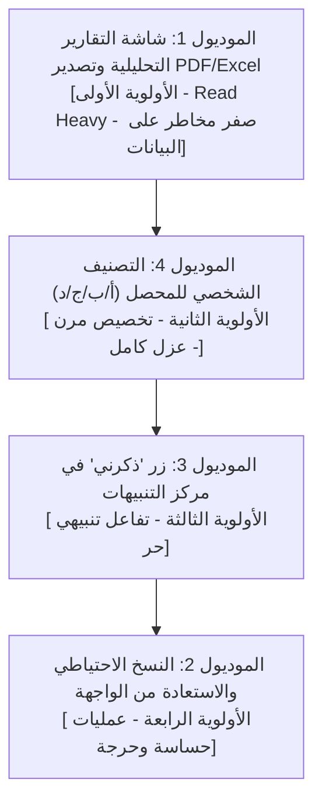

# 🗺️ الخطة الاستراتيجية وخريطة طريق الإصدار الثاني (V2 Master Roadmap)
## مشروع: نظام إدارة التحصيل ومتابعة العملاء (Smart Collection Platform - SCP)

---

### 📌 المقدمة والهدف الاستراتيجي
تحدد هذه الخطة تسلسل تنفيذ موديولات **الإصدار الثاني (V2)** الأربعة المعتمدة في وثيقة نطاق العمل (العقد)، وفق منهجية إدارة المخاطر المعمارية والبرمجية (Risk-Driven Sequencing). 

الهدف الأساسي من الترتيب هو **حماية استقرار النظام القائم (V1)**، ومنع أي انقطاع في سير العمل اليومي للتحصيل، والتأكد من بناء الميزات المتقدمة فوق أساسات بيانات صلبة ومستقرة.

---

### ⚖️ مصفوفة تحليل المخاطر وترتيب أولويات الموديولات



| الترتيب التنفيذي | الموديول في العقد | مستوى التأثير والمخاطر | التبرير الهندسي والمعماري |
| :---: | :--- | :---: | :--- |
| **1️⃣ الأول** | **شاشة التقارير التحليلية والتصدير (PDF / Excel)** | 🟢 **منعدم المخاطر (Zero Risk)** | استعلامات قراءة وتجميع (Read-Heavy Aggregations). لا تعدل على أي بيانات محاسبية أو متابعات قائمة. تمنح الإدارة رؤية شاملة وتحليلية فورية للنظام. |
| **2️⃣ الثاني** | **التصنيف الشخصي للمحصل (أ / ب / ج / د)** | 🟡 **منخفض جداً (Low Risk)** | ميزة تخصيص سلوكي للمحصل لتنظيم عمله اليومي. تُبنى بجداول وفهارس مستقلة عن الفئات الرسمية المعتمدة في V1 دون التأثير على قواعد احتساب الحوافز. |
| **3️⃣ الثالث** | **زر «ذكرني» في مركز التنبيهات** | 🟠 **منخفض - متوسط (Moderate)** | ميزة تفاعلية مرتبطة بمركز التنبيهات وجدولة الإشعارات. تأتي بعد تنظيم العملاء وتصنيفهم ليتمكن المحصل من ضبط تذكيراته الدقيقة. |
| **4️⃣ الرابع والأخير** | **النسخ الاحتياطي والاستعادة من الواجهة** | 🔴 **عالي الحساسية والخطورة (Critical)** | يتضمن صلاحيات متقدمة وحذف واستعادة بيانات (Data Wipe & Restore). تأخيره للنهاية يضمن استقرار كافة جداول ومخططات V1 و V2 ليتم شملها جميعاً في النسخ والاستعادة بأمان تام. |

---

### 📂 الهيكل التوجيهي لمجلدات وملفات الإصدار الثاني

تم تنظيم مجلدات وملفات V2 لتكون بمثابة أدلة عمل موجهة ومحكمة لوكلاء الذكاء الاصطناعي (AI Prompts) وفق المسار التالي:

```text
النسخة_الثانية/
├── 00_خطة_تنفيذ_الإصدار_الثاني_V2_ROADMAP.md      <-- الخريطة العامة الشاملة (هذا الملف)
└── 01_ميزة_التقارير_التحليلية/                   <-- الموديول الأول (بدء التنفيذ الفوري)
    ├── 00_خطة_ميزة_التقارير_التحليلية.md
    ├── 01_قاعدة_البيانات_والأمان_والدوال_التجميعية.md
    ├── 02_شاشة_التقارير_والمؤشرات_التلخيصية_والفلاتر.md
    ├── 03_الرسوم_البيانية_التفاعلية_والتحليل_البصري.md
    └── 04_محرك_تصدير_Excel_وتوليد_PDF_العربي.md
```

---

### 🔄 دورة العمل القياسية لكل برومبت (Life-Cycle Pipeline)
كل ملف تنفيذي في المجلدات الفرعية مُصمم ليُلزم وكيل الذكاء الاصطناعي بالخطوات التالية قبل الانتقال للمرحلة اللاحقة:

1. **التحليل والاستكشاف (Analysis & Discovery):** دراسة الكود الحالي، سياسات الأمان، والعلاقات بين الجداول.
2. **التصميم والمعمارية (Architecture & UI Design):** صياغة عقود الـ RPCs ومكونات الواجهة وتجربة المستخدم.
3. **التنفيذ البرمجي (Implementation):** كتابة الترحيلات وقواعد البيانات، خطافات البيانات، والمكونات.
4. **الفحص الشامل وإجراءات التحقق (Full Verification & QA):** فحص الأخطاء، اختبار الأنواع، فحص الصلاحيات والعزل، وفحص الحالات الطرفية.
5. **دليل فحص المستخدم والتغذية الراجعة (User Feedback Loop):** سيناريوهات جاهزة للمستخدم البشري لاختبار الميزة وتقديم الملاحظات.
