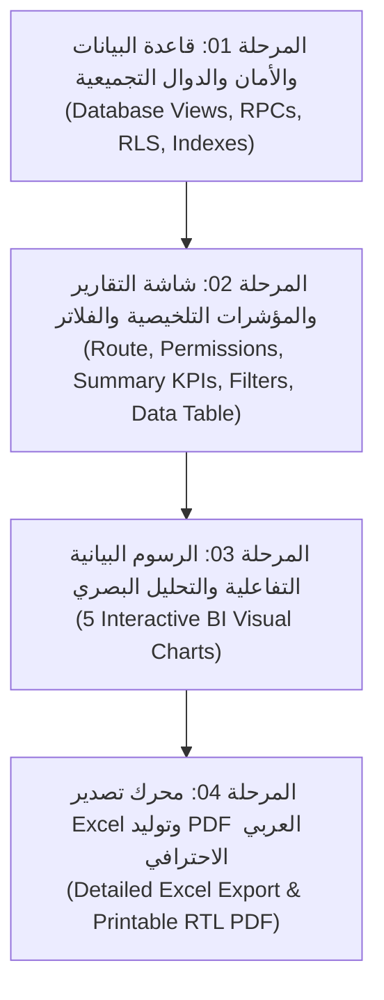

# 📊 الموديول الأول: خطة ميزة التقارير التحليلية المتقدمة
## Smart Collection Platform (SCP) - الإصدار الثاني (V2)

---

### 🎯 بطاقة تعريف الموديول
* **اسم الموديول في العقد:** الموديول الأول – شاشة التقارير التحليلية.
* **الهدف الأساسي:** تزويد الإدارة برؤية تحليلية كاملة لأداء قسم التحصيل ومديونيات العملاء عبر شاشة تحليل وقراءة مستقلة في القائمة الرئيسية للنظام.
* **حجم الموديول:** كبير (Major Module).
* **معايير القبول التعاقدية:**
  1. إظهار بيانات حقيقية دقيقة من قاعدة البيانات بنسبة 100% وليست بيانات وهمية.
  2. دعم كامل لتصدير PDF عالي الجودة باللغة العربية ومن اليمين لليسار (RTL) جاهز للطباعة والتوقيع الرسمي.
  3. تطبيق الصلاحيات على مستوى قاعدة البيانات (Row-Level Security & RPC Security Definer with Role Check) وليس على مستوى واجهة المستخدم فقط.

---

### 🧩 خريطة التفكيك المرحلي للموديول (4 مراحل تنفيذية)

---

### 📑 جدول ملفات المهام التنفيذية (AI Prompts Index)

| # | اسم الملف | النطاق والمخرجات المستهدفة | معايير الجودة والتحقق |
|---|---|---|---|
| **01** | [`01_قاعدة_البيانات_والأمان_والدوال_التجميعية.md`](file:///home/anas.axr/Downloads/Telegram%20Desktop/نظام%20إدارة%20التحصيل%20ومتابعة%20العملاء/النسخة_الثانية/01_ميزة_التقارير_التحليلية/01_قاعدة_البيانات_والأمان_والدوال_التجميعية.md) | بناء دوال SQL RPC للتجميع المالي السريع، حساب المديونيات وأداء المحصلين، وتطبيق الصلاحيات الصارمة في قاعدة البيانات. | صحة الأرقام، سرعة الاستعلام < 100ms، ومنع تسريب بيانات المحصلين للآخرين. |
| **02** | [`02_شاشة_التقارير_والمؤشرات_التلخيصية_والفلاتر.md`](file:///home/anas.axr/Downloads/Telegram%20Desktop/نظام%20إدارة%20التحصيل%20ومتابعة%20العملاء/النسخة_الثانية/01_ميزة_التقارير_التحليلية/02_شاشة_التقارير_والمؤشرات_التلخيصية_والفلاتر.md) | إضافة شاشة `/reports` في القائمة والصلاحيات، شريط الفلاتر الشامل، بطاقات المؤشرات الـ 5، وجدول البيانات التحليلي. | تجاوب كامل مع الموبايل والشاشات الكبيرة، وفلترة سلسة وسريعة. |
| **03** | [`03_الرسوم_البيانية_التفاعلية_والتحليل_البصري.md`](file:///home/anas.axr/Downloads/Telegram%20Desktop/نظام%20إدارة%20التحصيل%20ومتابعة%20العملاء/النسخة_الثانية/01_ميزة_التقارير_التحليلية/03_الرسوم_البيانية_التفاعلية_والتحليل_البصري.md) | بناء 5 مخططات بيانية تفاعلية (إجمالي المديونيات بالريال، أداء المحصلين، توزيع العملات، توزيع الحالات، ونسب التحصيل الشهرية). | مظهر جمالي فائق (Modern UI/UX)، تلميحات توضيحية عند التمرير (Tooltips)، وتفاعلية تامة. |
| **04** | [`04_محرك_تصدير_Excel_وتوليد_PDF_العربي.md`](file:///home/anas.axr/Downloads/Telegram%20Desktop/نظام%20إدارة%20التحصيل%20ومتابعة%20العملاء/النسخة_الثانية/01_ميزة_التقارير_التحليلية/04_محرك_تصدير_Excel_وتوليد_PDF_العربي.md) | تصدير ملفات Excel غنية بالبيانات المفصلة + توليد تقرير PDF رسمي عربي بتصميم طباعة فاخر جاهز للأختام والتوقيعات. | محاذاة RTL عربية صحيحة، وضوح النصوص والأرقام، وتنسيق الطباعة A4. |

---

### 🛡️ ضوابط الأمان والصلاحيات المعتمدة للموديول
* **مدير النظام (Admin):** يرى تقارير كافة المحصلين، والبيانات المالية الشاملة، وكافة الفئات.
* **المحاسب (Accountant):** يرى جميع التقارير المالية ومبالغ المديونيات والمبالغ المحصلة ونسب الحوافز.
* **مسؤول التحصيل (Collector):** يرى **تقاريره الشخصية والعملاء المنسوبين له فقط**، ولا يستطيع الاطلاع على إجماليات المنشأة أو بيانات زملائه المحصلين الآخرين إطلاقاً على مستوى الـ API والـ Database.
