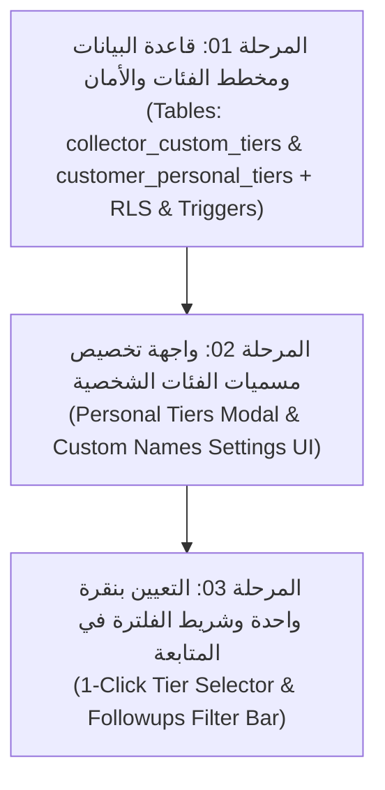

# 🏷️ الموديول الثاني: خطة ميزة التصنيف الشخصي للمحصل (أ / ب / ج / د)
## Smart Collection Platform (SCP) - الإصدار الثاني (V2)

---

### 🎯 بطاقة تعريف الموديول
* **اسم الموديول في العقد:** الموديول الرابع – التصنيف الشخصي للمحصل (أ / ب / ج / د).
* **الترتيب في خريطة الطريق:** الميزة الثانية تنفيذياً (لأنها ميزة تخصيص مرنة للمحصل لا تمس المنظومة المالية أو حساب الحوافز).
* **الهدف الأساسي:** تمكين كل مسؤول تحصيل من تقسيم وإدارة عملائه في 4 فئات شخصية مرنة (أ / ب / ج / د) بأسماء وتسميات يختارها هو حسب أسلوب عمله (مثل: "أولوية قصوى"، "اتصال أسبوعي"، "يسوق قريباً"، "مؤجل")، مع إمكانية تعيين العميل بنقرة واحدة وفلترة شاشة المتابعة حسب هذه الفئات.
* **حجم الموديول:** صغير – متوسط (Small to Medium Module).

---

### 🛡️ ضوابط الخصوصية ومعايير القبول التعاقدية
1. **الفئات الافتراضية:** كل مسؤول تحصيل يملك 4 فئات خاصة به: (أ، ب، ج، د).
2. **تغيير المسميات:** يستطيع المحصل تغيير اسم كل فئة بحرية تامة في أي وقت دون التأثير على زملائه.
3. **الفئة الافتراضية (د):** تحتوي تلقائياً على كافة عملاء المحصل كنقطة بداية (Default Tier).
4. **التعيين بنقرة واحدة:** من شاشة المتابعة أو ملف العميل، يستطيع المحصل تغيير فئة العميل بنقرة زر واحدة.
5. **شريط الفلترة:** شريط فلتر تفاعلي سريع في شاشة المتابعة (`FollowupsScreen`) لعرض فئة شخصية بعينها.
6. **الخصوصية والعزل التام:** لا يرى المحصل تصنيفات زملائه، والتصنيف شخصي بالكامل ولا يراه المدير كـ Official Classification رسمي، ولا يتداخل إطلاقاً مع نظام فئات العملاء الرسمي المعتمد في V1 لحساب الحوافز (`customer_category_id`).

---

### 🧩 خريطة التفكيك المرحلي للموديول (3 مراحل تنفيذية)

---

### 📑 جدول ملفات المهام التنفيذية (AI Prompts Index)

| # | اسم الملف | النطاق والمخرجات المستهدفة | معايير الجودة والتحقق |
|---|---|---|---|
| **01** | [`01_قاعدة_البيانات_وهيكل_الفئات_الشخصية_والأمان.md`](file:///home/anas.axr/Downloads/Telegram%20Desktop/نظام%20إدارة%20التحصيل%20ومتابعة%20العملاء/النسخة_الثانية/02_ميزة_التصنيف_الشخصي_للمحصل/01_قاعدة_البيانات_وهيكل_الفئات_الشخصية_والأمان.md) | إنشاء جداول الفئات الشخصية، التهيئة التلقائية للفئة (د)، وتطبيق سياسات RLS الصارمة لعزل بيانات كل محصل. | عزل تام بين المستخدمين، عدم تداخل مع فئات V1، وتهيئة تلقائية للعملاء الجدد. |
| **02** | [`02_واجهة_تخصيص_مسميات_الفئات_الشخصية.md`](file:///home/anas.axr/Downloads/Telegram%20Desktop/نظام%20إدارة%20التحصيل%20ومتابعة%20العملاء/النسخة_الثانية/02_ميزة_التصنيف_الشخصي_للمحصل/02_واجهة_تخصيص_مسميات_الفئات_الشخصية.md) | نافذة ومودال مرن يتيح للمحصل تخصيص أسماء الفئات الأربع (أ/ب/ج/د) وتعديلها بسهولة مع الحفظ اللحظي. | سهولة التعديل، التحقق من الإدخال، والتحديث الفوري للواجهة عبر React Query. |
| **03** | [`03_التعيين_بنقرة_واحدة_وشريط_الفلترة_في_المتابعة.md`](file:///home/anas.axr/Downloads/Telegram%20Desktop/نظام%20إدارة%20التحصيل%20ومتابعة%20العملاء/النسخة_الثانية/02_ميزة_التصنيف_الشخصي_للمحصل/03_التعيين_بنقرة_واحدة_وشريط_الفلترة_في_المتابعة.md) | شريط فلترة الفئات الشخصية في شاشة المتابعة، وأزرار التعيين السريع بنقرة واحدة في صفوف المتابعة وملف العميل. | استجابة فورية بنقرة واحدة، شارات ملونة جذابة، وفلترة سريعة دون تأخير. |
