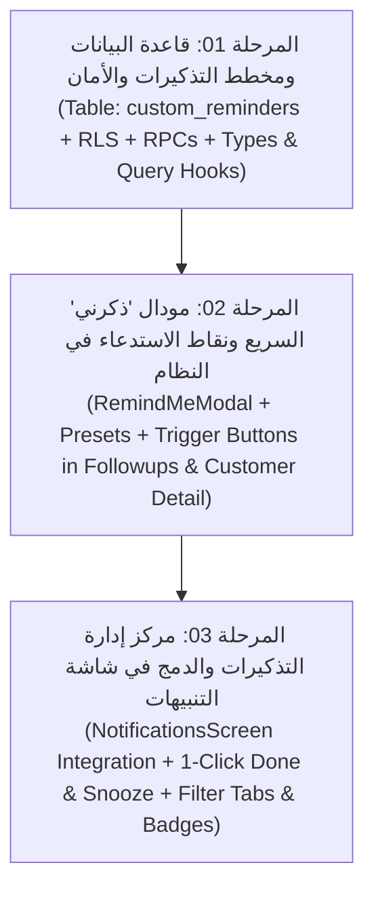

# ⏰ الموديول الثالث: خطة ميزة زر «ذكرني» ونظام التذكيرات الحرة المخصصة
## Smart Collection Platform (SCP) - الإصدار الثاني (V2)

---

### 🎯 بطاقة تعريف الموديول
* **اسم الموديول في العقد:** الموديول الثالث – زر «ذكرني» ونظام التذكيرات الحرة المخصصة (Ad-hoc Reminders & Custom Tasks Engine).
* **الترتيب في خريطة الطريق:** الميزة التنفيذية الثالثة في V2 (تأتي بعد استقرار التقارير التحليلية والتصنيف الشخصي للمحصل).
* **الهدف الأساسي:** تمكين كل مسؤول تحصيل ومستخدم في النظام من إنشاء وتعيين تذكيرات ومنبهات شخصية حرة مرتبطة بعميل معين أو مهام تحصيل مستقلة، دون التقيد الصارم بجدول الاستحقاق المحاسبي أو دورة المديونية المالية، مع إمكانية التحديد بنقرة زر واحدة وإدارتها عبر مركز التنبيهات وقائمة العمل اليومي.
* **حجم الموديول:** متوسط (Medium Module).
* **معايير القبول التعاقدية:**
  1. إمكانية إنشاء تذكير حر لأي عميل بنقرة واحدة من شاشة المتابعة، ملف العميل، أو مركز التنبيهات.
  2. خيارات جدولة سريعة ومسبقة: (غداً، بعد 3 أيام، بعد أسبوع، بعد أسبوعين، أو تاريخ ووقت مخصص).
  3. عزل تام للخصوصية (RLS): تذكيرات كل محصل خاصة به فقط ولا يراها زملاؤه.
  4. شريط وبطاقة تفاعلية في مركز التنبيهات تفرز: [ المستحق اليوم ] [ المتأخر ] [ القادم ] [ المكتمل ].
  5. دعم إجراءات الإنجاز الفوري (1-Click Mark Done) والتأجيل السريع (Snooze).
  6. عدم التأثير نهائياً على قواعد الاستحقاق المحاسبية أو فئات V1 أو نسب الحوافز.

---

### 🧩 خريطة التفكيك المرحلي للموديول (3 مراحل تنفيذية)

---

### 📑 جدول ملفات المهام التنفيذية (AI Prompts Index)

| # | اسم الملف | النطاق والمخرجات المستهدفة | معايير الجودة والتحقق |
|---|---|---|---|
| **01** | [`01_قاعدة_البيانات_وهيكل_التذكيرات_والأمان.md`](file:///home/anas.axr/Downloads/Telegram%20Desktop/نظام%20إدارة%20التحصيل%20ومتابعة%20العملاء/النسخة_الثانية/03_ميزة_زر_ذكرني_والتذكيرات_المخصصة/01_قاعدة_البيانات_وهيكل_التذكيرات_والأمان.md) | إنشاء جدول `custom_reminders`، الفهارس، سياسات RLS، ودوال الـ RPC للإنجاز والتأجيل واسترجاع التلخيص، مع تعريفات TypeScript والـ Query Hooks. | عزل تام للبيانات، استعلام فوري < 50ms، وحفظ آمن للعمليات. |
| **02** | [`02_مودال_ذكرني_السريع_ونقاط_الاستدعاء.md`](file:///home/anas.axr/Downloads/Telegram%20Desktop/نظام%20إدارة%20التحصيل%20ومتابعة%20العملاء/النسخة_الثانية/03_ميزة_زر_ذكرني_والتذكيرات_المخصصة/02_مودال_ذكرني_السريع_ونقاط_الاستدعاء.md) | بناء مكون `RemindMeModal.tsx` بأزرار الجدولة السريعة (غداً / 3 أيام / أسبوع)، ودمجه في جدول شاشة المتابعة وملف العميل. | فتح فوري للمودال، تجربة مستخدم فائقة السلاسة، ودعم إدخال التذكير بنقرة واحدة. |
| **03** | [`03_مركز_إدارة_التذكيرات_والدمج_في_شاشة_التنبيهات.md`](file:///home/anas.axr/Downloads/Telegram%20Desktop/نظام%20إدارة%20التحصيل%20ومتابعة%20العملاء/النسخة_الثانية/03_ميزة_زر_ذكرني_والتذكيرات_المخصصة/03_مركز_إدارة_التذكيرات_والدمج_في_شاشة_التنبيهات.md) | دمج بطاقة التذكيرات الشخصية في `NotificationsScreen`، شريط الفلترة، أزرار الإنجاز والتأجيل الفوري بنقرة واحدة، وتحديث شارات العداد الحي. | فرز وتصفية حية، تحديث تفاؤلي سريع، وعدم تداخل مع تنبيهات V1 الآلية. |

---

### 🛡️ ضوابط الأمان والعزل المعتمدة
1. **الخصوصية التامة:** كل مستخدم (سواء كان مسؤول تحصيل، محاسب، أو مدير) يدير مصفوفة تذكيراته الخاصة عبر سياسة RLS (`auth.uid() = user_id`).
2. **استقلالية التذكير:** التذكير لا يغير تاريخ الاستحقاق الرسمي للعميل (`due_dates`) ولا يعدل في أرصدة المديونية أو الحوافز.
3. **الربط الاختياري بالعميل:** يمكن إنشاء تذكير مخصص لعميل محدد (`customer_id`) أو إنشاء تذكير عام لمهمة تحصيل ميدانية حرة.
4. **توقيت اليمن الصارم:** يتم احتساب تواريخ التذكيرات بالاعتماد على التوقيت المحلي الموحد وتجنب مشاكل فارق المناطق الزمنية.
