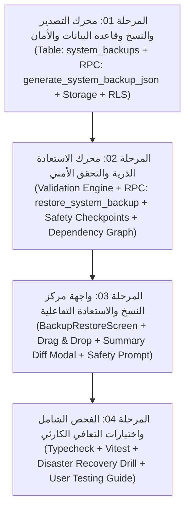

# 🛡️ الموديول الرابع: خطة ميزة مركز النسخ الاحتياطي والاستعادة من الواجهة
## Smart Collection Platform (SCP) - الإصدار الثاني (V2)

---

### 🎯 بطاقة تعريف الموديول
* **اسم الموديول في العقد:** الموديول الثاني في العقد / الموديول الرابع والأخير في خطة التنفيذ التنفيذية (Interactive Cloud Backup & Restore Engine).
* **الترتيب في خريطة الطريق:** الميزة التنفيذية الرابعة والأخيرة في V2 (تأتي بعد استقرار كافة جداول وهياكل V1 و V2: التقارير، التصنيف الشخصي، وتذكيرات ذكرني).
* **الهدف الأساسي:** تمكين مدير النظام حصراً من إنشاء وتحميل واستعادة نسخ احتياطية كاملة وموثوقة لقاعدة البيانات والبيانات التشغيلية للنظام بنقرة زر واحدة عبر واجهة تفاعلية آمنة، مع فحص التوافق، ونقاط أمان تلقائية تمنع فقدان البيانات، وسجل تدقيق صارم.
* **حجم الموديول:** كبير وعالي الحساسية والأهمية (Critical & Major Module).
* **معايير القبول التعاقدية:**
  1. تصدير نسخة احتياطية مشفرة/موقعة بهيكل JSON منظم مع الميتاداتا ومجموع التحقق (SHA-256 Checksum) لجميع جداول النظام (V1 + V2).
  2. استعادة ذرية متكاملة (Atomic Transactional Restore) تستعيد كافة السجلات والتبعيات وفق تسلسل طوبولوجي صارم يحافظ على سلامة القيود والمفاتيح الخارجية (Foreign Keys).
  3. إنشاء نقطة أمان آلية (Automatic Safety Snapshot) قبل تنفيذ أي عملية مسح أو استعادة لمنع الكوارث وتمكين التراجع الفوري (Rollback).
  4. حظر الصلاحية كلياً وحصرياً على غير مدير النظام على مستوى الـ RPC و RLS وواجهة المستخدم.
  5. واجهة استخدام احترافية وفائقة الجمال والأمان، تدعم السحب والإفلات، استعراض الفروقات (Diff & Inspection Preview)، وطلب تأكيد كتابي صريح قبل الاستعادة.
  6. تسجيل كامل وغير قابل للتعديل لكل عملية نسخ أو تحميل أو استعادة في سجل التدقيق الأمني (`activity_logs`).

---

### 🧩 خريطة التفكيك المرحلي للموديول (4 مراحل تنفيذية)

---

### 📑 جدول ملفات المهام التنفيذية (AI Prompts Index)

| # | اسم الملف | النطاق والمخرجات المستهدفة | معايير الجودة والتحقق |
|---|---|---|---|
| **01** | [`01_محرك_التصدير_والنسخ_الاحتياطي_وقاعدة_البيانات.md`](file:///home/anas.axr/Downloads/Telegram%20Desktop/نظام%20إدارة%20التحصيل%20ومتابعة%20العملاء/النسخة_الثانية/04_ميزة_النسخ_الاحتياطي_والاستعادة/01_محرك_التصدير_والنسخ_الاحتياطي_وقاعدة_البيانات.md) | إنشاء جدول `system_backups`، دالة الـ RPC `generate_system_backup_json` لتجميع كافة جداول V1 و V2 في حزمة JSON قياسية مع الميتاداتا و Checksum، وحفظ النسخ السحابية بأمان. | تصدير كامل بنسبة 100% لكافة الجداول، أمان RPC للمدير فقط، وتوليد حزمة متناسقة وسريعة. |
| **02** | [`02_محرك_الاستعادة_الذرية_والتحقق_الأمني.md`](file:///home/anas.axr/Downloads/Telegram%20Desktop/نظام%20إدارة%20التحصيل%20ومتابعة%20العملاء/النسخة_الثانية/04_ميزة_النسخ_الاحتياطي_والاستعادة/02_محرك_الاستعادة_الذرية_والتحقق_الأمني.md) | بناء محرك فحص توافق الحزم والـ Checksum، وإنشاء نقطة أمان آلية قبل الاستعادة، ودالة الـ RPC الذرية `restore_system_backup` التي تنفذ مسح وإعادة ملء الجداول وفق الترتيب الطوبولوجي الصحيح. | سلامة القيود والعلاقات بنسبة 100%، عدم كسر Foreign Keys، وتراجع تلقائي فوري عند أي خطأ. |
| **03** | [`03_واجهة_مركز_النسخ_الاحتياطي_والاستعادة_التفاعلية.md`](file:///home/anas.axr/Downloads/Telegram%20Desktop/نظام%20إدارة%20التحصيل%20ومتابعة%20العملاء/النسخة_الثانية/04_ميزة_النسخ_الاحتياطي_والاستعادة/03_واجهة_مركز_النسخ_الاحتياطي_والاستعادة_التفاعلية.md) | بناء شاشة مركز النسخ والاستعادة التفاعلية، بطاقات الحالة، زر النسخ الفوري مع التنزيل، جدول النسخ السحابية، منطقة رفع الملفات، ومودال استعراض محتوى النسخة وتأكيد الاستعادة المشدد. | تجربة مستخدم آمنة وواضحة، منع الأخطاء البشرية، ومؤشرات تحميل وحالة دقيقة. |
| **04** | [`04_الفحص_الشامل_واختبارات_التحمل_والاستعادة_الكارثية.md`](file:///home/anas.axr/Downloads/Telegram%20Desktop/نظام%20إدارة%20التحصيل%20ومتابعة%20العملاء/النسخة_الثانية/04_ميزة_النسخ_الاحتياطي_والاستعادة/04_الفحص_الشامل_واختبارات_التحمل_والاستعادة_الكارثية.md) | اختبارات TypeScript ووحدة Vitest للمحرك، وتنفيذ محاكاة كارثية عملية كاملة (Disaster Recovery Drill: أخذ نسخة -> تعديل بيانات -> استعادة -> مطابقة تامة)، ودليل اختبار المستخدم. | اجتياز 100% لاختبارات النوع والمطابقة، وسلامة تامة للبيانات بعد الاستعادة. |

---

### 🛡️ ضوابط الأمان الفولاذية والمحددات المعمارية
1. **قصر الصلاحية المطلق على مدير النظام:** منع أي مستخدم آخر (حتى المحاسب ومسؤولي التحصيل) من استدعاء دوال النسخ أو الاستعادة أو رؤية الشاشة (`require_admin()` في قاعدة البيانات والـ RLS).
2. **الاستعادة الذرية الشاملة (All-or-Nothing Atomicity):** تتم كافة خطوات المسح وإعادة الإدخال داخل معاملة SQL واحدة (`BEGIN ... EXCEPTION ... ROLLBACK`) تضمن عدم ترك النظام في حالة غير متسقة أبداً.
3. **نقطة الأمان الإلزامية (Mandatory Safety Pre-Snapshot):** قبل أن تبدأ دالة الاستعادة بتعديل أي صف، تأخذ لقطة فورية من الحالة الحالية وتحفظها كنسخة أمان (`safety_pre_restore`) للرجوع إليها في أي لحظة.
4. **حماية التبعيات والترتيب الطوبولوجي:**
   - **ترتيب الحذف (Reverse Dependency):** الجداول التابعة أولاً ثم الأساسية.
   - **ترتيب الإدخال (Dependency Order):** الجداول المرجعية والإعدادات -> العملاء -> الأرصدة والاستحقاق -> المتابعات والدفعات والحوافز -> التذكيرات والتصنيفات الشخصية.
5. **النزاهة والتوثيق المشفر:** كل ملف نسخة احتياطية يحوي بصمة رقمية مشفرة (Hash/Checksum) للتأكد من عدم تلاعب أحد بالملف يدوياً قبل رفعه.
