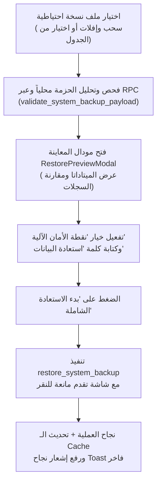

# 📄 برومبت المهمة 3: واجهة مركز النسخ الاحتياطي والاستعادة التفاعلية
## المرحلة: الثالثة (Frontend Interactive UI, Drag & Drop, Pre-flight Diff Preview Modal & Safe UX)
## الموديول: مركز النسخ الاحتياطي والاستعادة من الواجهة (V2 - Module 4)

---

### 🎯 1. بطاقة وسياق المهمة (Context & Scope)
بناء الواجهة التفاعلية لمركز النسخ الاحتياطي والاستعادة لمدير النظام، بتصميم بصري فاخر وعالي الأمان، يشتمل على بطاقات إحصائيات النظام، زر التصدير الفوري بنقرة واحدة، منطقة السحب والإفلات لملفات النسخ الاحتياطية الخارجية، جدول سجل النسخ المحفوظة مع إمكانية التنزيل والاستعادة المباشرة، ونافذة منبثقة تفاعلية لاستعراض ومقارنة بيانات النسخة (Pre-flight Inspection Modal) مع طلب تأكيد نصي صريح لمنع الأخطاء البشرية.

---

### 🔍 2. مرحلة التحليل والاستكشاف (Phase 1: Analysis & Discovery)

1. **موقع الواجهة في النظام:**
   * دمج مركز النسخ الاحتياطي والاستعادة كتبويب رئيسي فاخر داخل شاشة الإعدادات `/settings` (قسم مدير النظام)، مع إمكانية الوصول السريع له عبر مسار مخصص `/settings/backups` محمي بـ `RequireScreen`.

2. **عناصر تجربة المستخدم فائقة الأمان (Fail-Safe UX Principles):**
   * **تدرج تحذيري بصري:** استخدام الألوان التحذيرية الذكية (Amber/Red) للإجراءات الحساسة مثل الاستعادة والحذف.
   * **نافذة معاينة ومطابقة الفروقات (Pre-flight Diff Modal):** قبل الاستعادة، يُعرض للمدير مقارنة واضحة:
     - تاريخ إنشاء النسخة ومن قام بإنشائها.
     - جدول مقارنة الأعداد: (عدد العملاء في النسخة مقابل الحالي، عدد المتابعات، عدد الدفعات، إلخ).
   * **التأكيد النصي الإلزامي (Explicit Text Confirmation):** يُطلب من المدير كتابة عبارة `استعادة البيانات` أو الضغط على مفتاح تأكيد ثنائي لتفعيل زر الاستعادة النهائي.
   * **مؤشرات تحميل واضحة (Loading & Progress Overlays):** عرض شريط تقدم وتنبيه بعدم إغلاق المتصفح أثناء معالجة الاستعادة الذرية.

---

### 📐 3. مرحلة التصميم والمعمارية (Phase 2: Architecture & Component Design)

#### أ. هيكل المكونات (Component Tree):
```text
app/src/features/settings/backups/
├── BackupRestoreCenter.tsx          # المكون الرئيسي لمركز النسخ والاستعادة
├── components/
│   ├── BackupStatsCards.tsx         # 4 بطاقات إحصائية (إجمالي النسخ، آخر نسخة، حجم البيانات، حالة الأمان)
│   ├── CreateBackupCard.tsx         # بطاقة إنشاء وتنزيل نسخة فورية مع حقل الملاحظات
│   ├── RestoreDropzone.tsx          # منطقة السحب والإفلات لملفات JSON مع التحقق التلقائي
│   ├── RestorePreviewModal.tsx      # مودال المعاينة ومقارنة الأعداد والتأكيد النصي
│   └── BackupHistoryTable.tsx       # جدول النسخ السحابية والمحلية (تنزيل / استعادة / حذف)
```

#### ب. تدفق تجربة المستخدم عند الاستعادة (Restore User Flow):


---

### 💻 4. مرحلة التنفيذ البرمجي (Phase 3: Implementation)

#### 1. مكون `RestorePreviewModal.tsx`:
- يستقبل بيانات التحقق من صحة النسخة (`validationResult`).
- يعرض جدولاً أنيقاً يوضح:
  - اسم الجدول | السجلات في النسخة | السجلات الحالية في النظام
- يتضمن صندوق اختيار `إنشاء نقطة أمان تلقائية قبل الاستعادة` (مفعل افتراضياً).
- يتضمن حقل إدخال تأكيدي يلزم المدير بكتابة `استعادة البيانات`.
- زر باللون الأحمر `تأكيد وتنفيذ الاستعادة الشاملة`.

#### 2. مكون `RestoreDropzone.tsx`:
- منطقة سحب وإفلات تفاعلية للملفات بصيغة `.json`.
- قراءة محتوى الملف عبر `FileReader` وفحصه بواسطة JSON Parser.
- عرض اسم الملف وحجمه ومؤشر فحص سريع قبل فتح مودال التأكيد.

#### 3. مكون `CreateBackupCard.tsx`:
- حقل اختياري لإضافة ملاحظات (مثل: "نسخة قبل استيراد شهر سبتمبر").
- زر `إنشاء وتنزيل نسخة احتياطية فورية` يستدعي دالة التصدير ويقوم بتنزيل الملف مباشرة للمتصفح عبر Blob Download.

#### 4. مكون `BackupHistoryTable.tsx`:
- جدول يعرض سجل كافة النسخ الموجودة في `system_backups`:
  - اسم النسخة، النوع (شارة ملونة: يدوية 🟢 / أمان تلقائية 🔵 / مجدولة 🟣)، تاريخ الإنشاء، حجم الملف، المستخدم، وأزرار الإجراءات (تنزيل الملف، استعادة، حذف السجل).

---

### 🧪 5. مرحلة الفحص والاختبار الشامل (Phase 4: Full QA & Verification)

1. **فحص الـ TypeScript وخلو الأخطاء:**
   ```bash
   cd app && npm run typecheck
   cd app && npm run build
   ```
2. **فحص تجربة المستخدم والتجاوب:**
   - التأكد من تجاوب الجداول والمودال مع مختلف أحجام الشاشات (الهاتف، التابلت، والشاشات العريضة).
   - التأكد من صحة النصوص والاتجاه من اليمين لليسار (RTL).
3. **فحص الحالات الطرفية (Edge Cases):**
   - محاولة رفع ملف نصي غير صالح أو تالف والتأكد من إظهار رسالة خطأ واضحة ومفهومة للمستخدم.
   - التأكد من عدم تفعيل زر الاستعادة إلا بعد كتابة العبارة التأكيدية بدقة تامة.

---

### 📋 6. دليل إرشاد المستخدم لاختبار الميزة وتغذية الملاحظات (Phase 5: User Testing & Feedback)

#### 📝 خطوات فحص المستخدم:
1. التوجه إلى شاشة الإعدادات -> تبويب "النسخ الاحتياطي والاستعادة".
2. الضغط على زر "إنشاء وتنزيل نسخة احتياطية"، والتأكد من تنزيل الملف وحفظ السجل في الجدول.
3. تجربة سحب ملف النسخة وإفلاته في منطقة الاستعادة.
4. التأكد من ظهور نافذة المعاينة وجدول مقارنة السجلات بوضوح.
5. تجربة كتابة عبارة "استعادة البيانات" وتنفيذ العملية بنجاح.

#### 💬 نموذج التغذية الراجعة من المستخدم (Feedback Template):
```text
- [ ] هل ظهرت شاشة مركز النسخ والاستعادة بتصميم سلس وواضح؟ (نعم / لا)
- [ ] هل يعمل التصدير والتنزيل الفوري بسلاسة؟ (نعم / لا)
- [ ] هل نافذة المعاينة والتأكيد النصي تمنع الأخطاء بفعالية؟ (نعم / لا)
- الملاحظات الإضافية: [أدخل ملاحظاتك هنا إن وجدت]
```
